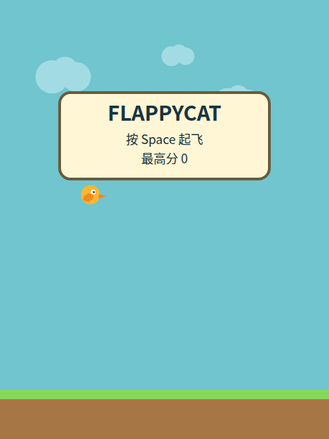
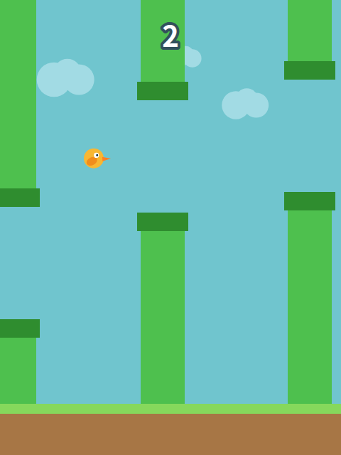
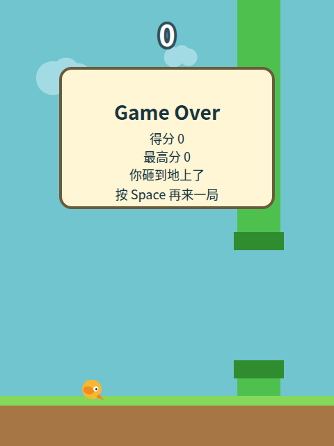

# FLAPPYCAT

网页版 flappy bird。纯前端、零运行时依赖，一个不碰 I/O 的引擎加一层薄壳 canvas 渲染。

**玩法**：`Space` 或点击起飞，穿过管道，撞上就死。死了再按一下重开。
**M** 键或页面上那个按钮切声音。最高分和声音开关都存在浏览器本地，不上传。

**在线玩**：https://supercubegame.github.io/flappycat/

## 长什么样

| 开局 | 游戏中 | 结束 |
| --- | --- | --- |
|  |  |  |

这三张是**按引擎几何手画的示意图**，不是浏览器跑出来的截图。真截图每轮 CI 都拍三张（`shot-ready.png` / `shot-play.png` / `shot-dead.png`），传成 Actions 里的 artifact。
**而现在它们已经不一致了**：死亡弹窗多了一行最高分，真实高度从 172 涨到 200，示意图还是旧的。这笔欠账登记在 `docs/OBLIGATIONS.json` 里，过期快闸门会红。

闸门守的不是“这三张图好不好看”，而是两件硬事：SVG 里声明的画布尺寸必须等于引擎的 `WORLD_W × WORLD_H`；README 引用的图集合必须等于 `docs/shots/` 下的实际文件集合，双向。新加一张忘了引会红，删一张而 README 还引着也会红。

## 安装与运行

需要 **Node.js 22 以上**。玩游戏本身不需要装任何东西，装依赖只是为了跑浏览器闸门。

```bash
git clone https://github.com/supercubegame/flappycat.git
cd flappycat

# 1. 只想玩：起一个静态服务器，然后浏览器开 http://127.0.0.1:8080
npm run serve

# 2. 想跑闸门：先装依赖与 Chromium
npm install
npx playwright install --with-deps chromium

# 3. 快闸门，零依赖，几十秒
npm run verify

# 4. 浏览器闸门，真起页面真敲键真数像素真重载
npm run verify:web

# 5. 把两份报告合成一条评论（CI 跑的就是它）
npm run report

# 6. 盖一次心跳戳。本地跑只写 last_manual_run，**不**影响新鲜度判定
npm run heartbeat
```

不想本地装任何东西的话，不用构建：仓库本身就是一个静态站点，`index.html` 直接就是入口。注意别用 `file://` 打开,ES 模块在那下面加载不了，必须走 HTTP。

## 仓库结构

- `src/engine.mjs` — 纯核心。`step(state, input)` 返回新状态，不改入参，不碰 I/O。最高分的**规则**（`bestOf`）也在这里,它是纯函数。
- `src/render.mjs` — 只读状态画图，不做游戏逻辑，基线坐标从 CONFIG 读。
- `src/main.mjs` — 浏览器外壳：本地存储、音频、`window.__FLAPPY` 诊断出口。
- `scripts/verify.mjs` — 快闸门。
- `scripts/verify-web.mjs` — 浏览器闸门。
- `scripts/heartbeat.mjs` — 心跳的参数与判定（纯函数）。
- `heartbeat.json` — 定时闸门真的跑过的痕迹。**只有定时那次会写它。**
- `docs/OBLIGATIONS.json` — 带期限的义务，过期快闸门就红。

## 闸门到底在证明什么

七条承重的：

1. **机器人能连过十几根管道**，八个种子各跑一遍。一条同时证明关卡可通过、计分在走、碰撞在拦。
2. **浏览器里跑出来的一局 == 同一份纯引擎在 Node 里跑同样帧数的结果**。分数、跳跃数、存活管道数、鸟的高度全要对得上。尺子是独立的，所以这里一个猜的数都没有。
3. **像素等号**。管道只用整数坐标的平色矩形画，没有反锥齿，所以“某横带里管体色像素数 == 从引擎快照推导的应有值”能同时守住三件事：画出来了、画对了几根、画面跟上状态了。
4. **翻越高度与关卡间距的耦合**。用引擎自己跑一遍量，不是拄计划值做乘法。两侧都会红。
5. **最高分真的活过了一次页面重载**。读内存变量证明不了持久化，而且先拿分再死，不然得到的是一条 `0 == 0` 的空断言。
6. **声音两个方向都会红**。开着必须真的启动了音源节点，关了必须一个都不启动。
7. **定时闸门真的跑过**，见下一节。

另外每一类扫描器都配了**变异体**，而且先断言“替换真的发生了”，否则得到的是一个静默通过的假变异体。

## 定时闸门与心跳

只挂 push 有一个洞：没人推代码的时候，上游改了东西而闸门仍然“全绿”,因为它压根没跑。所以现在每天定时跑一次。

而定时任务自己也会被平台因仓库不活跃而**静默停用**，那时工作流文件一个字都不会变。所以“读配置确认 cron 还在”这种检查，会在它本该抓住的那次失效上保持绿色。**“没有坏消息”和“已经死了”长得一模一样，带时间戳的正向痕迹不会。**

所以定时那次会把时间戳写进 `heartbeat.json` 并推回主干，而快闸门检查那个痕迹有多新。四个设计点：

- **新鲜度上限不是拍的**，是从 cron 频率推导的（周期 + 2 天余量）。改 cron 而不重算这个数，那条等号断言当场红。
- **频率取每天而不是每周。** 写得越勤，“读到的痕迹有多旧”就越不依赖两个定时之间的先后顺序,而那个顺序是个假设，平台定时经常延迟十几分钟。分钟数也故意不取整点。
- **防自触发靠结构，不靠提交信息里的跳过标记。** 写心跳只在 schedule 或显式手动请求时执行，它推出去的提交触发的是普通 push，那一次永远不写。循环由构造终止，不依赖任何字符串。有一条扫描器断言那一行里不得出现提交信息。
- **手动盖戳写的是另一个字段。** 新鲜度只读 `last_scheduled_run`,一次手动不得救活一条已经死掉的 cron，有一条断言专门守这一点。

三个状态分得很清，因为后续动作不同：`awaiting-first-run`（还在嬽限期内，正常）、`never-ran`（cron 根本没生效）、`stale`（cron 被停用了）。

## 阀值怎么定

能推导就不拍。机器人得分本来写的是 `score >= 5`，而那条断言等到 5 就停，于是实测值永远恰好等于下限,这样的数字什么也告诉不了你。现在它是一条等号。

帧率下限反方向：它**改松了**，从 20 降到 12。实测 38-40，紧到正常波动就会撞的下限是一台假红工厂，而假红会逗人去改产品迁就尺子。它只该抓彻底卡死。另配了一条判词不同的断言：有人把它收紧到超过实测基线的三分之一，就红。**而第一个违反它的人是我自己**：写了下限 13 配基线 38，13×3=39 > 38，当场红。正确动作是改下限，不是把三倍放宽成两倍。

## 测不出来的

- **能不能真的听到声音。** 闸门只证明了音源节点被创建并启动，以及静音时一个都不启动。扬声器里究竟有没有声、好不好听，都验不了。已登记成带期限的义务。
- **好不好玩。** 全绿不代表好玩，这一条只能人验收。
- **手机触屏的手感。** 代码里有 `pointerdown`，CI 验不了真机手感。
- **隐私模式 / 禁用存储时的降级路径。** 代码里有 try，降级事实也会被记下来并报到评论里，但 CI 里没有真的把存储禁掉跑一遍。
- **递归到最后一环没人看着。** 心跳守的是定时，而心跳新鲜度这条断言本身跑在快闸门里，靠推送或定时触发。残余风险是“cron 死了**而且**没人推送”,那一段只能靠人或外部观察者。真要堵上，得把链条拉到**跳出这个仓库**去。现在没做，写在这里而不假装已经闭合。
